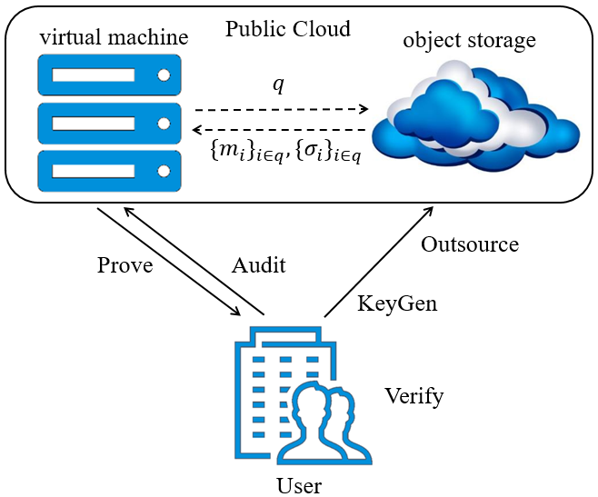

# cloud object storage integrity checking

COS-integrity-checking (cloud-object-storage-integrity-checking) is a cloud storage auditing system that works for current main-stream cloud object storage services. This system is designed over existing proof of data possession (PDP) schemes. We further make them practical as well as usable in the real world.

Our cloud storage auditing system has three parts: client, server, and the backend cloud object storage (COS). COS-integrity-checking includes client and server directly; the server will communicate with COS. The architecture is shown below. The client part is called the *user* and the server part is called the *virtual machine*.



In the implementation, we also provide a [python script](challenge_length.py) to compute the challenge length `l` that is used by PDP scheme.

## Build

We use Java 1.8.0_231 to develop this project and use IntelliJ IDEA and Maven to compile it.

Please import this project into IntelliJ IDEA and it will automatically import all dependencies in pom.xml.

## Usage

We provide compiled versions on the [release](https://github.com/fchen-group/cloud-object-storage-integrity-checking/releases) page, including server and client. You should ensure that the Java environment is installed before running the program.

**Server**

Before running the server, one needs to specify the temporary file location that is to be outourced to a public cloud ojbect storage service and the COS properties file that contains the cloud storage access credentials. [Here](COS.properties.example) is a template for COS properties file. After all preparations are done, one could run a command in terminal to start server as follows:

```
java -jar server.jar /path/to/temporary-upload-directory /path/to/COS-properties-file
```

**Client**

The client's command format is like this:

```
java -jar client.jar SERVER_IP COMMAND FILENAME [SECTOR_NUMBER]
```

One needs to specify the server's ip, command (`outsource` or `audit`), and the name of the file. The `SECTOR_NUMBER` is only used in the outsourcing stage.

## Contributing

Please feel free to hack on COS-integrity-checking! We're happy to accept contributions.
